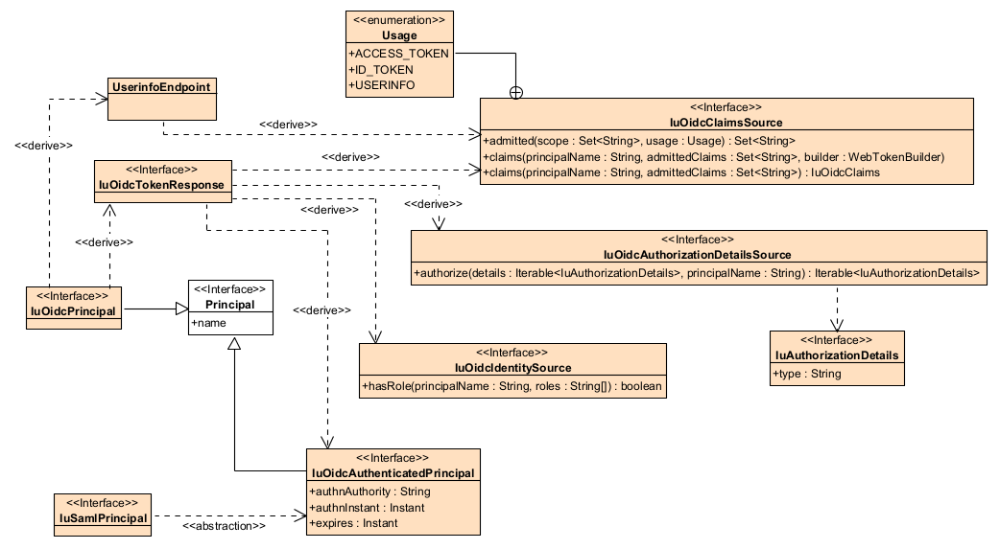
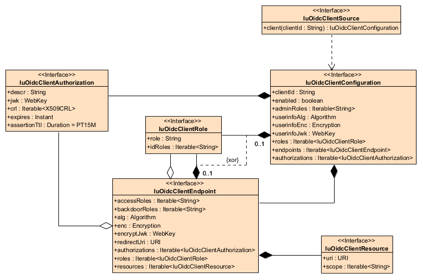

IU OpenID Connect and OAuth 2.0 Configuration
---------------------------------------------

Overview
========

`iu-java-oidc-config` (module `iu.util.oidc.config`, package `edu.iu.oidc.config`) is the OpenID Provider's integration layer: what a deployment configures, and the interfaces it implements over its own backing resources — a directory, a group service, a login mechanism. The provider endpoints in `iu.util.oidc.provider` consume these interfaces; an implementation of them must never depend on `iu.util.oidc.provider`.

Deriving `IuOidcPrincipal`
==========================

A «derive» arrow points from the derived element to what it is computed from. An application endpoint — the relying party — holds an `IuOidcPrincipal`, computed from the token response and the UserInfo response the provider issued. Both of those are computed from four seams the deployment implements: `IuOidcAuthenticatedPrincipal`, `IuOidcClaimsSource`, `IuOidcIdentitySource`, and `IuOidcAuthorizationDetailsSource`. `UserinfoEndpoint` is the protocol endpoint, served on this side by `iu.oidc.provider.OidcUserinfoEndpoint`. `IuSamlPrincipal` is one concrete form of the `IuOidcAuthenticatedPrincipal` abstraction; nothing in this module depends on SAML.

Implementing a provider
=======================

### Bind everything through one `IuOidcProviderReference`

Every provider endpoint takes a single `iu.oidc.provider.IuOidcProviderReference` and reads each seam through it, so two endpoints cannot be wired to disagree about who the provider is. The reference lives in `iu.util.oidc.provider` and is implemented by whatever stands the provider up; the seams it hands over live here, so their implementations need no provider dependency. Only `getConfiguration()` is abstract. Every other binding either refuses by name when it is needed and missing (`Missing claims source`) or defaults safely: `getAuthorizationDetailsSource()` releases nothing, and `isProduction()` answers `true`, which keeps impersonation through token exchange closed.

Relying party registrations are read through `IuOidcClientSource`, which is equally mandatory; see [Client registration](#client-registration).

### `IuOidcAuthenticatedPrincipal` — who authenticated

Returned from `IuOidcProviderReference.getAuthenticatedPrincipal(IuRequestAttributes)`. Adapt whatever mechanism the deployment authenticates with; an `IuSamlPrincipal`, for example, supplies the first three properties one-to-one.

| Property | Becomes |
|---|---|
| `name` | the principal name every grant is issued for, and the `sub` of every token and UserInfo document |
| `authnAuthority` | the `acr` claim — typically the identity provider's entity ID |
| `authnInstant` | the `auth_time` claim, and the instant a refresh token's lifetime is measured from |
| `expires` | whether the authentication is still usable; `null` or past sends the end user back to log in |

Return `null` when nothing is established — the first pass of every authorization is unauthenticated, not a failure — or throw to interrupt the flow with a login redirect the provider does not handle itself.

### `IuOidcClaimsSource` — what is published about the end user

Disclosure is decided in two halves. The claim sets OpenID Connect §5.4 binds to `profile`, `email`, `address`, and `phone` are mapped by the provider; every other scope is the deployment's.

- `admitted(scope, usage)` names the claims the deployment's own scopes release. It only ever sees scopes §5.4 does not define. `Usage` says where the result is headed — `USERINFO` is the widest disclosure, `ID_TOKEN` narrower because the relying party keeps it, `ACCESS_TOKEN` narrower still — so a claim can be published from UserInfo and kept out of a durable token.
- `claims(principalName, admittedClaims, builder)` writes typed claims onto a token being issued, including a signed UserInfo response.
- `claims(principalName, admittedClaims)` answers the unsigned UserInfo document; its `toString()` must render the claims document, which the provider publishes without reading.

Write nothing beyond `admittedClaims`, and answer for exactly `principalName` — the relying party refuses a UserInfo response whose `sub` disagrees with its ID token. A scope of the deployment's own must also be registered on some `IuOidcClientResource.getScope()`, or the authorization request is refused as `invalid_scope` before this source is consulted.

### `IuOidcIdentitySource` — what the end user is entitled to

A client endpoint declares application roles as `IuOidcClientRole`, each naming the identity roles (`getIdRoles()`) that grant it. `hasRole(principalName, roles...)` decides which of those the principal holds, and the matching application roles (`getRole()`) are issued as the `roles` claim. A role of `all`, and a role naming the principal directly, are settled before the source is asked. Throw when the principal name cannot be resolved (answered as `invalid_request`); answer `false` when the principal is known and holds none of the roles.

### `IuOidcAuthorizationDetailsSource` — what RFC 9396 details are released

`authorize(details, principalName)` is called once per grant, after the end user authenticates and before an authorization code is issued. Return what is released, or `null` to release nothing. The exception thrown decides who hears about a refusal:

| Thrown | Answered as |
|---|---|
| `IuBadRequestException` | `invalid_authorization_details` on the client's redirect URI — the only refusal relayed to the client |
| `IuAuthorizationFailedException` | forbidden |
| `IuOutOfServiceException` | unavailable, so a caller can retry |
| anything else | server error |

The provider sees only `IuAuthorizationDetails.getType()`. A deployment whose details carry properties beyond the type registers a claim adapter for its own implementation.

### What the application endpoint sees

| `IuOidcPrincipal` | Read from | Supplied by |
|---|---|---|
| `getName()` | ID token `sub`, or a configured principal name claim | `IuOidcAuthenticatedPrincipal.name` |
| `getClaim(...)`, `getOidcClaims()` | ID token, then UserInfo | `IuOidcClaimsSource` |
| `getAcr()` | ID token `acr` | `IuOidcAuthenticatedPrincipal.authnAuthority` |
| `hasRole(...)` | ID token `roles`, limited to the roles the relying party configures | `IuOidcIdentitySource` |
| `hasScope(...)` | granted `scope` on the token response, or the requested scope if the response omits it | [client registration](#client-registration) |
| `getAuthorizationDetails(...)` | token response `authorization_details`, then the ID token | `IuOidcAuthorizationDetailsSource` |

Client registration
===================

`IuOidcClientSource.client(clientId)` reads one relying party's registration, whole. An `IuOidcClientConfiguration` owns everything a registration describes: its endpoints (one per redirect URI), its roles, and its authorization records. Each `IuOidcClientEndpoint` owns its resources, selects which of the client's authorization records it accepts, and either shares the client's roles or owns roles of its own — a role belongs to the client or to one endpoint, never both (`{xor}`).

### Implementing `IuOidcClientSource`

Answer `null`, or throw, for a client that isn't registered; the provider refuses both the same way, indistinguishably from a client that never existed. Every provider endpoint reads through the source on every request, so caching is the implementation's decision — but a failed lookup should not be cached, so a client registered a moment ago is found on the next request. A disabled client (`enabled` false) stays registered, and the authorization and token endpoints refuse it as though it weren't — no new code, token, or refresh. Access tokens already issued keep working until they expire: UserInfo, like any resource server, trusts a token this provider signed and does not re-check the registration. Disabling a client is therefore bounded by the access token lifetime (fifteen minutes by default), not immediate.

Assemble the registration the way the provider reads it. The provider reaches authorization records and roles only through an endpoint: `IuOidcClientEndpoint.getAuthorizations()` authenticates the client, and `IuOidcClientEndpoint.getRoles()` is the only role mapping it consults. `IuOidcClientConfiguration.getAuthorizations()` and `IuOidcClientConfiguration.getRoles()` describe what the client owns; they are for whatever manages the registration, not for the provider.

### Lifecycle

Resources, endpoints, and endpoint-owned roles live and die with their parent, so a registration can be read, written, and versioned as one document. Authorization records and client-owned roles are also children of the client, but each endpoint relates to them differently, and that difference reaches every layer an implementation builds over this: its data store, its REST API, its management interface.

**Authorization records are owned by the client and selected by each endpoint.** Not every record reaches every endpoint.

- **Key.** An endpoint references a record rather than embedding it, so a record needs an identity scoped to its client — (client ID, authorization ID). The interface carries no ID; `descr` is a description, not a key. The management layer defines one.
- **Same-client references only.** An endpoint may select only records its own client owns; a composite foreign key on (client ID, authorization ID) enforces it. This is a security boundary, not a convenience. The provider trusts a record because it reached it through the requesting client's own endpoints, so a record referenced from another client authenticates as that client too: a shared secret, because `client_secret_basic` and `client_secret_post` bind nothing but the secret; a shared key, because an assertion's `iss` and `sub` need only name the requested `client_id`; a shared certificate authority, because nothing binds a certificate's subject to a client.
- **Unselected records.** A record no endpoint selects — one staged for rotation, or retained for history — still belongs to the client. `IuOidcClientConfiguration.getAuthorizations()` lists it; the provider never consults it.
- **Deletion.** Deleting a client deletes its records. Deleting a record removes every endpoint's reference to it in the same transaction, or is refused while any remain. Removing a record from an endpoint deletes nothing.
- **Rotation.** An endpoint tries its records in order, and the first that accepts the presented credential wins. Rotate by adding the new record, selecting it ahead of the old one on each endpoint that should honor it, and letting the old one reach `expires`. An expired record is skipped rather than refused, so rotation needs no change to the client itself.
- **Revocation.** Takes effect when the client's cached registration does. Revoking or expiring a record invalidates that one client's cache entry.
- **Governance.** `adminRoles` covers the client's records, since they are part of its registration.
- **REST shape.** Records are a sub-collection of the client (for example `/clients/{id}/authorizations`) that endpoints link to by ID. Key material needs handling of its own: a secret is write-only, only public keys and certificates are ever returned, and every change is audited apart from edits to the client.

**Roles are owned by the client and shared by every endpoint, or owned by one endpoint.**

- **Client roles reach the provider through the endpoints.** The provider consults only `IuOidcClientEndpoint.getRoles()`, so a source must include the client's roles in every endpoint's `getRoles()`, alongside that endpoint's own. A source that doesn't issues no `roles` claim for the client-level mappings, and nothing reports it.
- **Every endpoint gets every client role.** Unlike authorization records, client roles are not selected per endpoint; an endpoint that needs a different mapping owns its own.
- **Name collisions.** A client role and an endpoint role may share a `role` name with different `idRoles`. Both reach the endpoint's effective set, and the provider issues each match, so the `roles` claim can repeat a name. Reject duplicate names within an endpoint's effective set, or define which wins — the endpoint's own role over the client's, for example.
- **Scope of a change.** Editing or deleting a client role changes every endpoint at once; an endpoint role goes when its endpoint does.
